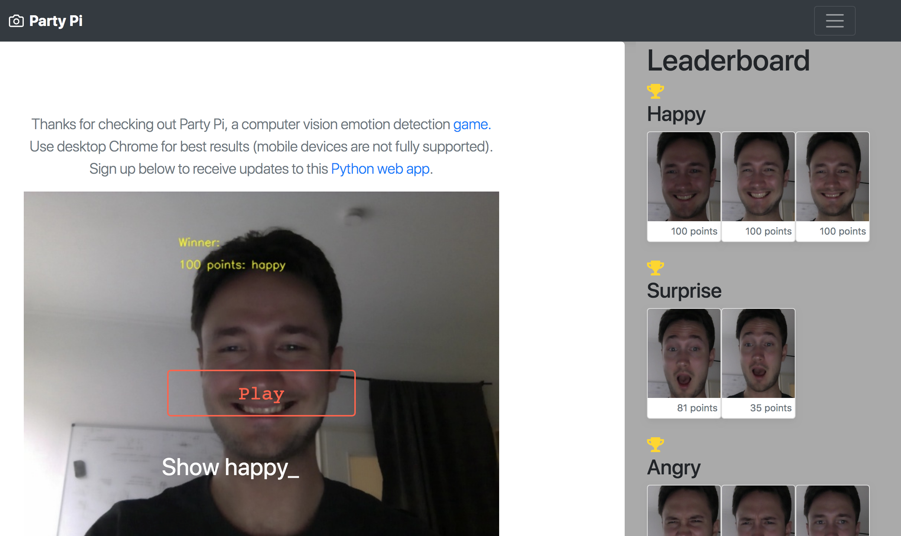

Party Pi
========

|license| |nbsp|

Emotion detection game using computer vision.

Description
===========

Interactive game that ranks players by their ability to show an emotion (eg, "Show surprise").

Emotion detection is accomplished using an Inception-based neural network trained in TensorFlow on the FER2013 dataset. Face detection is accomplished using OpenCV's Haar cascade.

Demo
====

`Pics from the first demo at the Institute of Cognitive Science 2016 Christmas Party <https://imgur.com/a/zzf6O>`_

Play
====

Visit https://partytest2.herokuapp.com with Desktop Chrome or Firefox.

Run locally
===========

Clone repository:

.. code-block:: bash

    git clone https://github.com/JustinShenk/party-pi.git
    cd party-pi

Install dependencies:

.. code-block:: bash

    pip3 install -r requirements.txt

If using Ubuntu, install tkinter with ``sudo apt-get install python3-tk``

.. code-block:: bash

    gunicorn -c gunicorn.conf main:app

Open a browser to `https://localhost:5000`.

Docker
======

Pull the docker image with `docker pull justinshenk/partypi:latest`.

Run the server interactively with ``docker run -it -p 5000:5000 partypi`` and open a browser to https://localhost:5000.

In Chrome (or Firefox), click Advanced and proceed past the warning.

Raspberry Pi
============

Additional (optional)  arguments: ``--picam`` for piCamera module and ``--slow`` to slow down the countdown.

Select Easy or Hard Mode (left or right arrow keys).

Awards, Press, Demos
====================

- `Featured <https://software.intel.com/en-us/blogs/2017/08/23/intel-developer-mesh-editor-s-picks-august-2017>`_ in the Intel Developer Mesh Editor's Picks (August 2017)
- Awarded the 2017 Intel Hack Challenge prize
- The technology was demonstrated at Intel's AI booth at NIPS 2017
- Party Pi was demoed for students and faculty at the 2016 and 2017 Osnabrück University Institute of Cognitive Science Christmas parties
- Received the 2018 Open Source Software Prize from Intevation GmbH

TODO
====
- Fix alignment of user interface elements
- Fix display of elements
- Fix mobile image processing
- Test latest version on Raspberry Pi (support is deprecated)

Author
======

`Justin Shenk`_ (`@JustinShenk`_) created Party Pi.

.. _Justin Shenk: https://linkedin.com/in/JustinShenk/
.. _@JustinShenk: https://github.com/JustinShenk/

License
=======

`MIT <https://github.com/JustinShenk/party-pi/blob/master/LICENSE>`_

.. |license| image:: https://img.shields.io/badge/license-MIT-blue.svg
.. |PyPi| image:: https://badge.fury.io/py/partypi.svg
    :target: https://badge.fury.io/py/partypi
    :alt: PyPi Badge
.. |nbsp| unicode:: 0xA0
   :trim:
